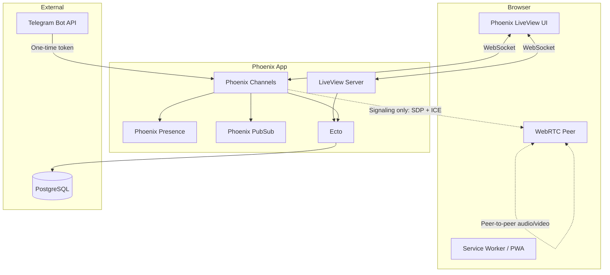
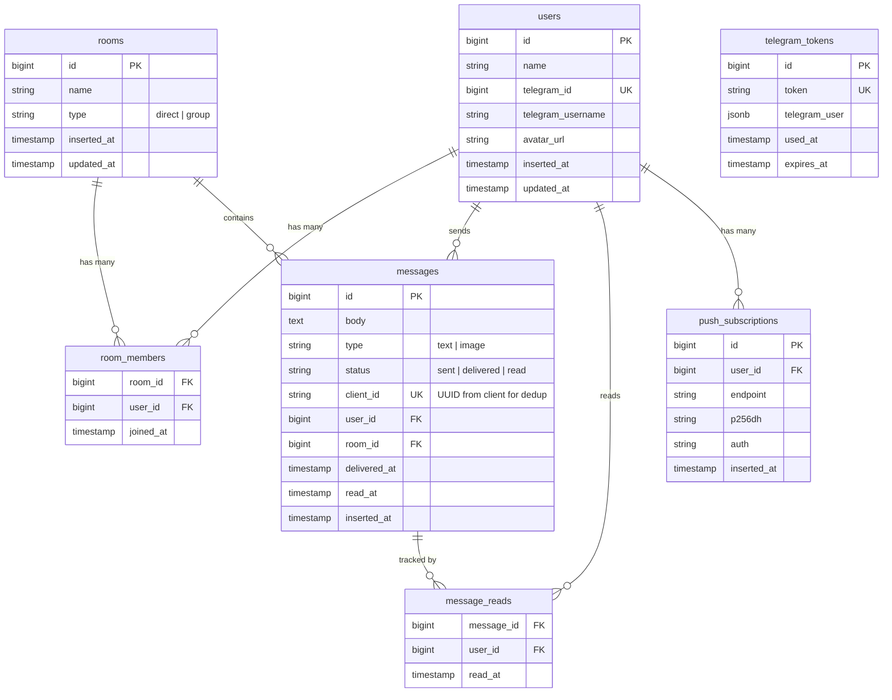
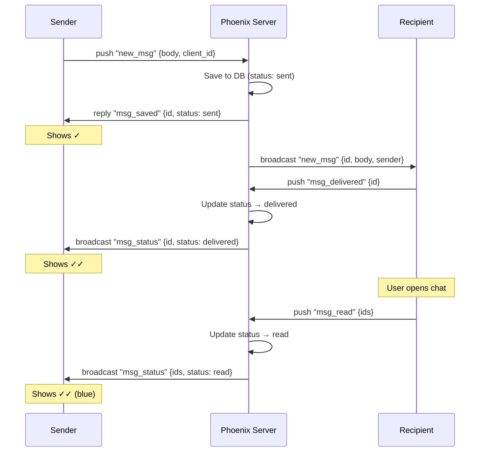
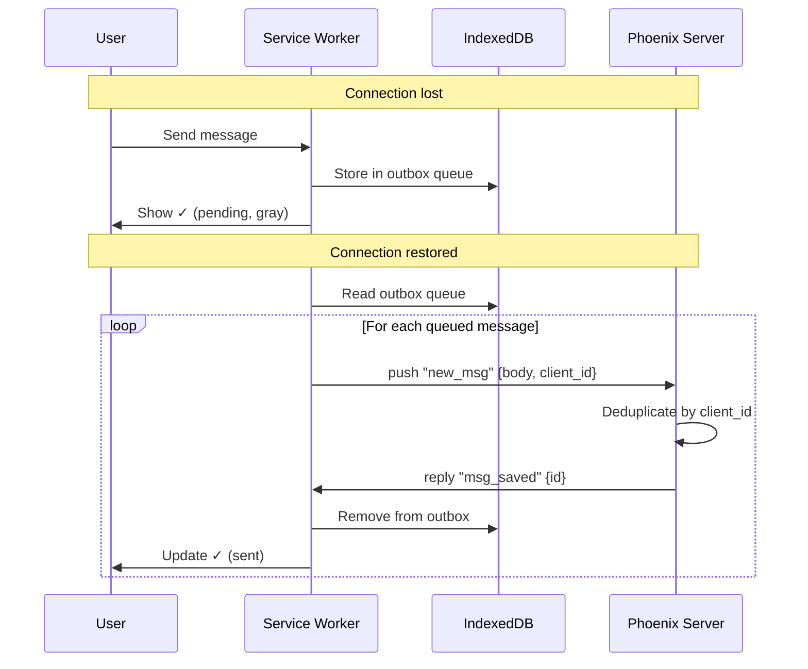
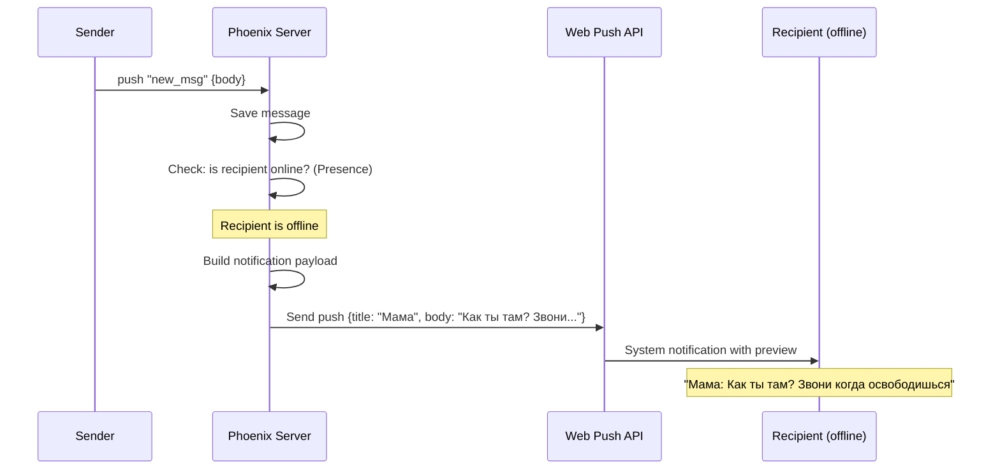

# Architecture

## System Overview



## Components

### Phoenix Channels — Real-time Messaging

Channels handle all real-time communication:

- **`room:lobby`** — general presence and notifications
- **`room:{id}`** — per-room messaging channel
- **`call:{room_id}`** — WebRTC signaling for a specific room

When a user sends a message:
1. Client pushes `"new_msg"` event to `room:{id}`
2. Channel handler saves the message to PostgreSQL via Ecto
3. Channel broadcasts the message to all subscribers via PubSub
4. All connected clients in the room receive the message instantly

### Phoenix LiveView — Reactive UI

LiveView renders the entire UI server-side and sends diffs over WebSocket:

- Room list and navigation
- Message rendering and scrolling
- User settings and profile
- Online presence indicators

Minimal JavaScript hooks handle:
- WebRTC peer connection setup
- Image paste/upload
- Scroll position management
- PWA install prompt

### Phoenix Presence — Online Status

Presence tracks who is online in real-time:

```
User joins room → Presence.track(socket, user_id, metadata)
User leaves/disconnects → automatically removed
Presence diff broadcast → UI updates online indicators
```

Uses CRDT (conflict-free replicated data type) under the hood — works correctly across multiple server nodes.

### Phoenix PubSub — Message Broadcasting

PubSub distributes messages across processes (and nodes in a cluster):

```
Channel receives message → PubSub.broadcast("room:123", event)
All subscribers on all nodes → receive the event
```

### Ecto + PostgreSQL — Persistence

All data is stored in PostgreSQL. Ecto provides:
- Schema definitions and validations
- Migrations for schema changes
- Query composition

## Database Schema



### Relationships

- **users ↔ rooms**: many-to-many through `room_members`
- **rooms → messages**: one-to-many, a room contains many messages
- **users → messages**: one-to-many, a user sends many messages
- **messages → message_reads**: tracks which users have read each message (for group chats)
- **users → push_subscriptions**: Web Push endpoints for notifications
- **telegram_tokens**: standalone, linked to user by `telegram_user` JSONB data

## Message Delivery Statuses

Every message has a status visible to the sender:

| Status | Icon | Meaning |
|--------|------|---------|
| `sent` | &#10003; | Server received and saved the message |
| `delivered` | &#10003;&#10003; | Recipient's client received the message |
| `read` | &#10003;&#10003; (blue) | Recipient opened the chat and saw the message |



In group chats, `message_reads` table tracks per-user read status. The message shows "read" when all members have seen it.

## Offline Message Queue

When the connection drops, messages don't get lost — they queue locally and send automatically on reconnect.



Key details:
- Each message gets a `client_id` (UUID) before sending — used for deduplication on the server
- IndexedDB stores the outbox queue — survives browser restarts
- Service Worker handles reconnection and queue flush
- Server ignores duplicate `client_id` values — safe to retry

## Smart Push Notifications

Notifications show the sender's name and message preview instead of generic "new message" text.



Notification features:
- **Sender name as title** — you see who wrote immediately
- **Message preview in body** — truncated to ~100 chars
- **Click opens the specific chat** — not just the app home page
- **Grouped by room** — multiple messages from one chat stack into one notification
- Uses standard Web Push API — works on Android, desktop browsers; iOS Safari 16.4+

## WebRTC Signaling Flow

WebRTC calls are peer-to-peer. The Phoenix server only handles signaling (exchanging connection metadata). No audio or video data passes through the server.

```mermaid
sequenceDiagram
    participant A as Caller Browser
    participant S as Phoenix Channel
    participant B as Callee Browser

    A->>S: join "call:room_id"
    B->>S: join "call:room_id"

    Note over A: User clicks "Call"
    A->>A: createOffer() → local SDP
    A->>S: push "offer" {sdp}
    S->>B: broadcast "offer" {sdp}

    B->>B: setRemoteDescription(offer)
    B->>B: createAnswer() → local SDP
    B->>S: push "answer" {sdp}
    S->>A: broadcast "answer" {sdp}

    A->>A: setRemoteDescription(answer)

    loop ICE Candidate Exchange
        A->>S: push "ice_candidate" {candidate}
        S->>B: broadcast "ice_candidate" {candidate}
        B->>S: push "ice_candidate" {candidate}
        S->>A: broadcast "ice_candidate" {candidate}
    end

    Note over A,B: Peer-to-peer connection established
    A<-->B: Audio/Video via DTLS-SRTP
```

### Steps Explained

1. Both users join the signaling channel `call:{room_id}`
2. Caller creates an SDP offer (description of what media they can send/receive)
3. Offer is relayed through the Phoenix Channel to the callee
4. Callee creates an SDP answer and sends it back
5. Both peers exchange ICE candidates (network path information)
6. Browser establishes a direct peer-to-peer connection
7. Audio/video flows directly between browsers, encrypted with DTLS-SRTP

## Authentication & Invites

See [auth.md](auth.md) for the full authentication and invite system documentation.

### Why Telegram?

- No passwords to remember or leak
- No email verification flow
- Telegram bots are easy to set up and free
- One-click login via Telegram Login Widget
