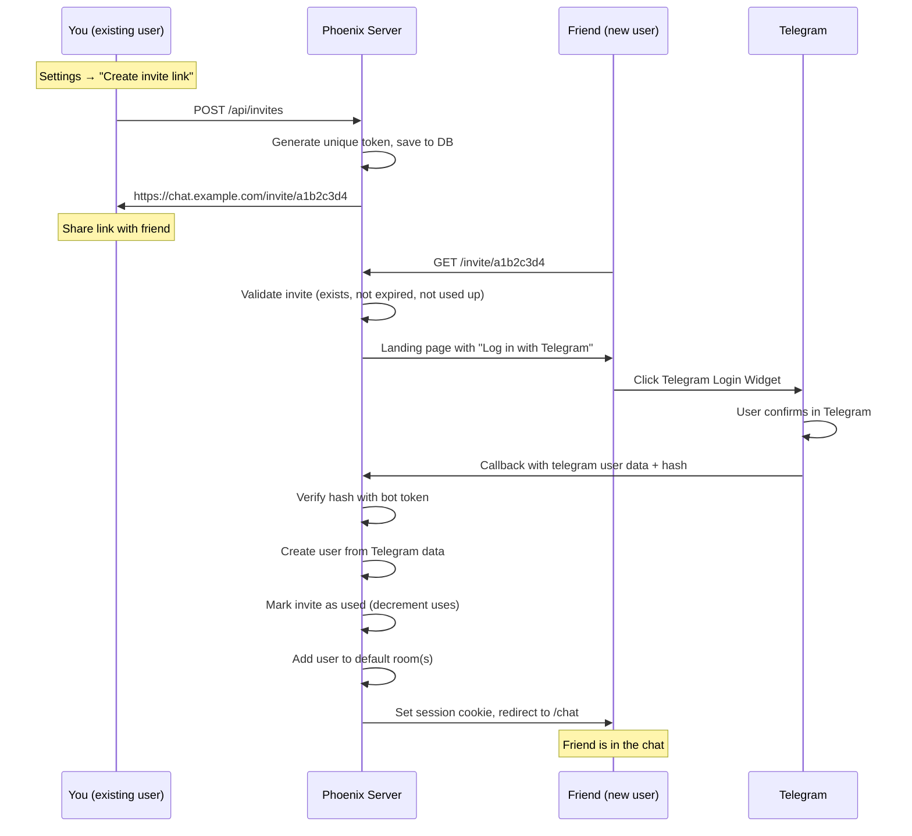
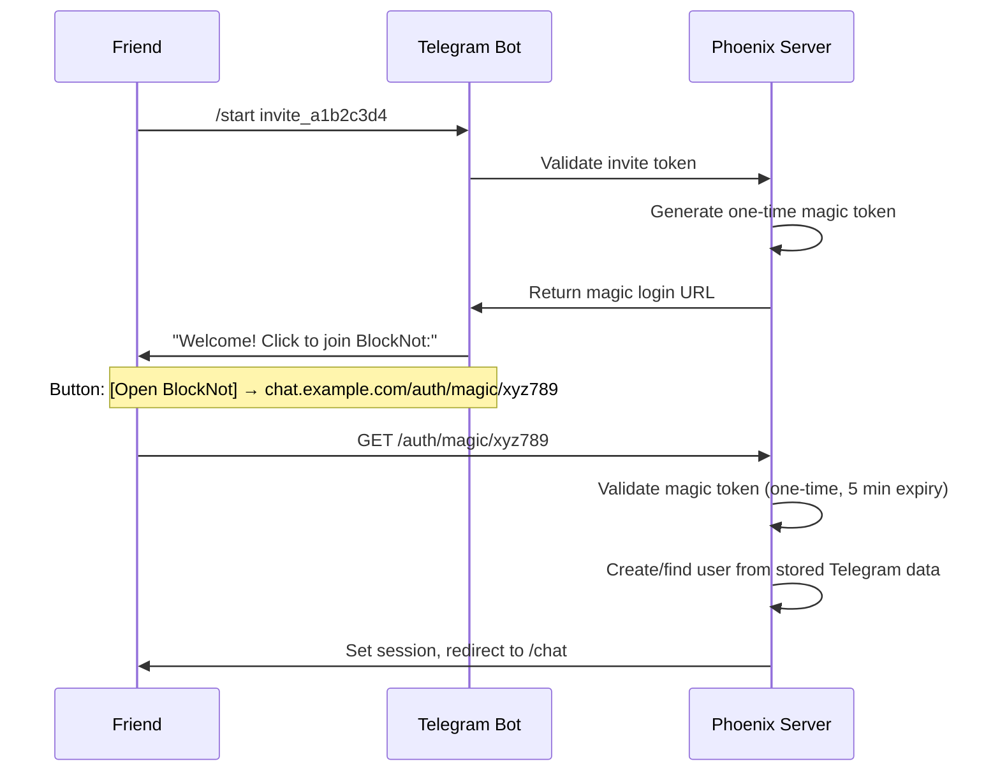
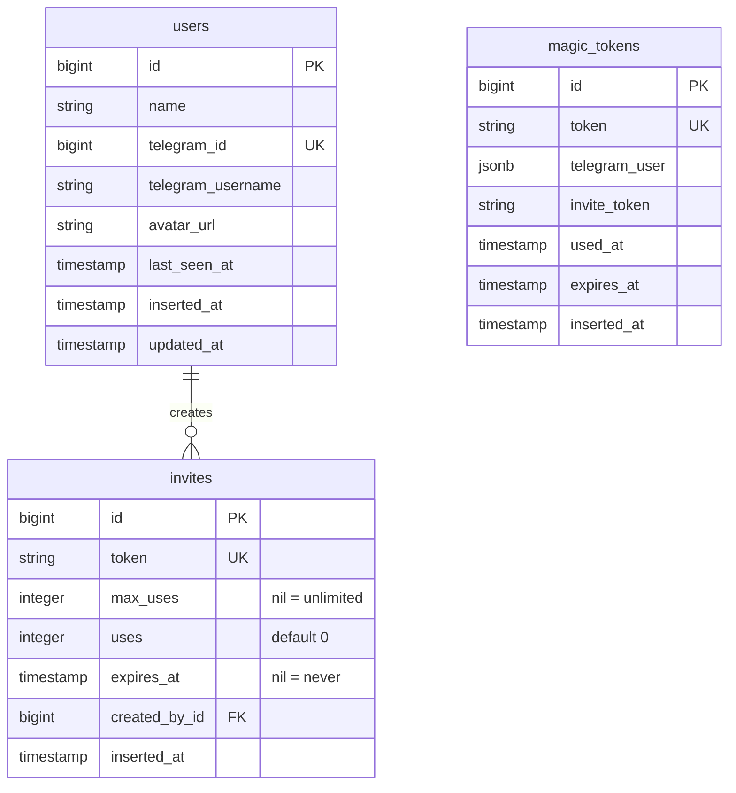

# Authentication & Invite System

BlockNot uses Telegram as the sole auth provider. No passwords, no emails — just Telegram.

## User Journey

The entire flow from invite to chatting:

```
You copy invite link from BlockNot settings
  → Share with a friend (any messenger, SMS, in person)
    → Friend opens link in browser
      → Sees landing page with "Log in with Telegram" button
        → Clicks → confirms in Telegram popup
          → Redirected to chat, already logged in
```

**2 clicks. Zero manual input.**

## Invite Links

### How Invites Work

Each registered user can generate invite links from settings. An invite link looks like:

```
https://chat.example.com/invite/a1b2c3d4
```



### Database

```elixir
# migration
create table(:invites) do
  add :token, :string, null: false
  add :max_uses, :integer, default: 1
  add :uses, :integer, default: 0
  add :expires_at, :utc_datetime
  add :created_by_id, references(:users, on_delete: :delete_all), null: false

  timestamps()
end

create unique_index(:invites, [:token])
```

### Invite Types

| Type | `max_uses` | `expires_at` | Use case |
|------|-----------|-------------|----------|
| Single | 1 | 24h | Invite one specific person |
| Multi | 10 | 7 days | Invite a small group |
| Permanent | nil (unlimited) | nil (never) | Family link, always open |

### Invite Management (Settings Page)

```elixir
defmodule BlocknotWeb.InviteLive do
  use BlocknotWeb, :live_view

  def render(assigns) do
    ~H"""
    <div class="settings-section">
      <h2>Invite Links</h2>

      <!-- Create new invite -->
      <form phx-submit="create_invite" class="invite-form">
        <select name="type">
          <option value="single">One person (expires in 24h)</option>
          <option value="multi">Up to 10 people (expires in 7 days)</option>
          <option value="permanent">Permanent link</option>
        </select>
        <button type="submit" class="btn-primary">Create link</button>
      </form>

      <!-- Active invites -->
      <div :for={invite <- @invites} class="invite-item">
        <div class="invite-info">
          <code class="invite-link"><%= invite_url(invite) %></code>
          <span class="invite-meta">
            <%= invite.uses %>/<%= invite.max_uses || "∞" %> used
            · <%= if invite.expires_at, do: "expires #{format_relative(invite.expires_at)}", else: "permanent" %>
          </span>
        </div>
        <div class="invite-actions">
          <button phx-click="copy_invite" phx-value-token={invite.token} class="icon-btn">
            <.icon name="hero-clipboard" />
          </button>
          <button phx-click="delete_invite" phx-value-id={invite.id} class="icon-btn">
            <.icon name="hero-trash" />
          </button>
        </div>
      </div>
    </div>
    """
  end

  def handle_event("create_invite", %{"type" => type}, socket) do
    attrs = case type do
      "single"    -> %{max_uses: 1, expires_at: hours_from_now(24)}
      "multi"     -> %{max_uses: 10, expires_at: days_from_now(7)}
      "permanent" -> %{max_uses: nil, expires_at: nil}
    end

    {:ok, invite} = Accounts.create_invite(socket.assigns.current_user, attrs)
    {:noreply, stream_insert(socket, :invites, invite)}
  end
end
```

### Invite Context

```elixir
defmodule Blocknot.Accounts do
  def create_invite(user, attrs) do
    %Invite{}
    |> Invite.changeset(Map.put(attrs, :token, generate_token()))
    |> Ecto.Changeset.put_assoc(:created_by, user)
    |> Repo.insert()
  end

  def use_invite(token) do
    Repo.transaction(fn ->
      invite = Repo.get_by!(Invite, token: token) |> Repo.preload(:created_by)

      cond do
        invite.expires_at && DateTime.compare(DateTime.utc_now(), invite.expires_at) == :gt ->
          Repo.rollback(:expired)

        invite.max_uses && invite.uses >= invite.max_uses ->
          Repo.rollback(:used_up)

        true ->
          invite
          |> Ecto.Changeset.change(%{uses: invite.uses + 1})
          |> Repo.update!()
      end
    end)
  end

  defp generate_token do
    :crypto.strong_rand_bytes(16) |> Base.url_encode64(padding: false)
  end
end
```

## Telegram Login Widget (Primary Auth)

The official [Telegram Login Widget](https://core.telegram.org/widgets/login) — a button on your site that authenticates via Telegram. No bot interaction needed from the user.

### Setup in BotFather

```
1. Open @BotFather
2. /mybots → select your bot
3. Bot Settings → Domain → add your domain (chat.example.com)
```

### Landing Page (Invite URL)

When a friend opens the invite link, they see this page:

```elixir
defmodule BlocknotWeb.InviteController do
  use BlocknotWeb, :controller

  def show(conn, %{"token" => token}) do
    case Accounts.validate_invite(token) do
      {:ok, _invite} ->
        render(conn, :landing, token: token)

      {:error, :expired} ->
        render(conn, :error, message: "This invite link has expired")

      {:error, :used_up} ->
        render(conn, :error, message: "This invite link has been used")
    end
  end
end
```

### Landing Page Template

```heex
<!-- invite/landing.html.heex -->
<div class="landing-page">
  <div class="landing-card">
    <div class="landing-logo">
      
    </div>

    <h1>You're invited to BlockNot</h1>
    <p>A private chat for family and friends</p>

    <!-- Telegram Login Widget -->
    <div class="telegram-login">
      <script
        async
        src="https://telegram.org/js/telegram-widget.js?22"
        data-telegram-login={@bot_username}
        data-size="large"
        data-radius="8"
        data-auth-url={url(~p"/auth/telegram/callback?invite=#{@token}")}
        data-request-access="write"
      ></script>
    </div>

    <p class="landing-hint">
      Click the button above to log in with your Telegram account.
      No passwords needed.
    </p>
  </div>
</div>
```

### CSS for Landing Page

```css
.landing-page {
  min-height: 100vh;
  display: flex;
  align-items: center;
  justify-content: center;
  background: var(--bg-primary);
  padding: 16px;
}

.landing-card {
  background: var(--bg-secondary);
  border-radius: 16px;
  padding: 48px 32px;
  text-align: center;
  max-width: 400px;
  width: 100%;
}

.landing-logo img {
  width: 80px;
  height: 80px;
  margin-bottom: 24px;
}

.landing-card h1 {
  font-size: 24px;
  font-weight: 600;
  color: var(--text-primary);
  margin-bottom: 8px;
}

.landing-card p {
  color: var(--text-secondary);
  font-size: 15px;
  margin-bottom: 24px;
}

.telegram-login {
  display: flex;
  justify-content: center;
  margin: 24px 0;
}

.landing-hint {
  font-size: 13px;
  color: var(--text-secondary);
}
```

### Auth Callback Controller

Telegram sends user data to your callback URL with a hash for verification:

```elixir
defmodule BlocknotWeb.TelegramAuthController do
  use BlocknotWeb, :controller

  @bot_token Application.compile_env(:blocknot, :telegram_bot_token)

  def callback(conn, params) do
    with :ok <- verify_telegram_hash(params),
         {:ok, _invite} <- maybe_use_invite(params["invite"]) do

      user = find_or_create_user(params)

      conn
      |> put_session(:user_id, user.id)
      |> redirect(to: ~p"/chat")
    else
      {:error, :invalid_hash} ->
        conn |> put_flash(:error, "Authentication failed") |> redirect(to: ~p"/")

      {:error, reason} ->
        conn |> put_flash(:error, invite_error(reason)) |> redirect(to: ~p"/")
    end
  end

  defp verify_telegram_hash(params) do
    # Telegram verification: https://core.telegram.org/widgets/login#checking-authorization
    received_hash = params["hash"]

    check_string =
      params
      |> Map.drop(["hash", "invite"])
      |> Enum.sort_by(fn {k, _} -> k end)
      |> Enum.map(fn {k, v} -> "#{k}=#{v}" end)
      |> Enum.join("\n")

    secret_key = :crypto.hash(:sha256, @bot_token)
    computed_hash = :crypto.mac(:hmac, :sha256, secret_key, check_string) |> Base.encode16(case: :lower)

    if computed_hash == received_hash, do: :ok, else: {:error, :invalid_hash}
  end

  defp find_or_create_user(params) do
    telegram_id = String.to_integer(params["id"])

    case Accounts.get_user_by_telegram_id(telegram_id) do
      nil ->
        {:ok, user} = Accounts.create_user(%{
          telegram_id: telegram_id,
          name: build_name(params),
          telegram_username: params["username"],
          avatar_url: params["photo_url"]
        })
        user

      user ->
        # Update profile from Telegram (name, photo may have changed)
        {:ok, user} = Accounts.update_user(user, %{
          name: build_name(params),
          avatar_url: params["photo_url"]
        })
        user
    end
  end

  defp build_name(params) do
    [params["first_name"], params["last_name"]]
    |> Enum.reject(&is_nil/1)
    |> Enum.join(" ")
  end

  defp maybe_use_invite(nil), do: {:ok, nil}  # no invite = existing user login
  defp maybe_use_invite(token), do: Accounts.use_invite(token)

  defp invite_error(:expired), do: "This invite link has expired"
  defp invite_error(:used_up), do: "This invite link has already been used"
end
```

### Router

```elixir
# router.ex
scope "/", BlocknotWeb do
  pipe_through :browser

  # Invite landing page
  get "/invite/:token", InviteController, :show

  # Telegram callback (widget redirects here)
  get "/auth/telegram/callback", TelegramAuthController, :callback

  # Protected routes
  pipe_through :require_auth
  live "/chat", ChatLive.Index
  live "/settings", SettingsLive
end
```

## Bot Magic Link (Fallback)

For cases where the Login Widget doesn't work (rare, e.g., embedded browsers), the bot sends a clickable login link instead of a raw token.



### Bot Handler

```elixir
defmodule Blocknot.TelegramBot do
  use Telegex.Polling

  def on_message(%{"text" => "/start " <> invite_token} = msg) do
    telegram_user = msg["from"]

    case Accounts.validate_invite(invite_token) do
      {:ok, _invite} ->
        # Generate a one-time magic login token
        {:ok, magic} = Accounts.create_magic_token(%{
          telegram_user: telegram_user,
          invite_token: invite_token,
          expires_at: minutes_from_now(5)
        })

        login_url = "#{Application.get_env(:blocknot, :base_url)}/auth/magic/#{magic.token}"

        Telegex.send_message(telegram_user["id"],
          "Welcome to BlockNot! Click the button below to join.",
          reply_markup: %{
            inline_keyboard: [[
              %{text: "Open BlockNot", url: login_url}
            ]]
          }
        )

      {:error, _reason} ->
        Telegex.send_message(telegram_user["id"],
          "This invite link is no longer valid. Ask for a new one."
        )
    end
  end
end
```

### Magic Token Schema

```elixir
# migration
create table(:magic_tokens) do
  add :token, :string, null: false
  add :telegram_user, :map, null: false   # JSON with id, first_name, etc.
  add :invite_token, :string
  add :used_at, :utc_datetime
  add :expires_at, :utc_datetime, null: false

  timestamps()
end

create unique_index(:magic_tokens, [:token])
```

### Magic Auth Controller

```elixir
defmodule BlocknotWeb.MagicAuthController do
  use BlocknotWeb, :controller

  def show(conn, %{"token" => token}) do
    case Accounts.use_magic_token(token) do
      {:ok, magic} ->
        user = find_or_create_user_from_magic(magic)

        # Use the invite if present
        if magic.invite_token, do: Accounts.use_invite(magic.invite_token)

        conn
        |> put_session(:user_id, user.id)
        |> redirect(to: ~p"/chat")

      {:error, :expired} ->
        conn |> put_flash(:error, "Link expired. Ask for a new invite.") |> redirect(to: ~p"/")

      {:error, :already_used} ->
        conn |> put_flash(:error, "Link already used. Ask for a new invite.") |> redirect(to: ~p"/")
    end
  end
end
```

## Auth Plug (Session Check)

```elixir
defmodule BlocknotWeb.Plugs.RequireAuth do
  import Plug.Conn
  import Phoenix.Controller

  def init(opts), do: opts

  def call(conn, _opts) do
    case get_session(conn, :user_id) do
      nil ->
        conn
        |> put_flash(:error, "Please log in")
        |> redirect(to: "/")
        |> halt()

      user_id ->
        user = Blocknot.Accounts.get_user!(user_id)
        assign(conn, :current_user, user)
    end
  end
end
```

## Updated Database Schema



## Summary

| Method | When | User experience |
|--------|------|----------------|
| **Telegram Login Widget** | Primary, always available on invite page | Click button → confirm in Telegram → done |
| **Bot magic link** | Fallback, when widget doesn't load | Open bot → click button → done |

Both methods:
- Zero manual input (no tokens to copy-paste)
- Auto-create user profile from Telegram data (name, photo)
- Validate invite before allowing registration
- One-time use tokens with expiry for security
