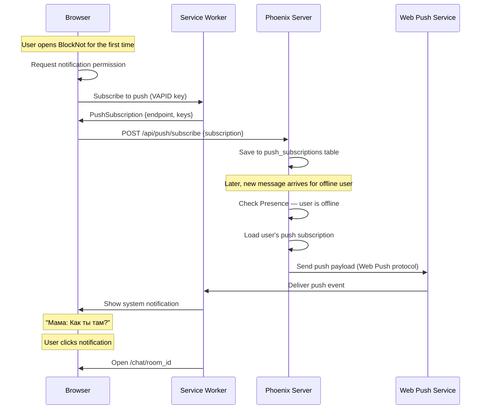

# PWA — Install as App + Push Notifications

BlockNot can be installed as a native-like app from the browser — with its own icon on the home screen, full-screen mode, and push notifications.

## What Users See

```
┌─ Chrome/Safari address bar ────────────────────────┐
│  🔒 chat.example.com              [⊕ Install]     │
└────────────────────────────────────────────────────┘
                      ↓ click
┌─────────────────────────────────────┐
│  Install BlockNot?                  │
│                                     │
│  This app can be installed on your  │
│  device as a standalone app.        │
│                                     │
│       [Cancel]    [Install]         │
└─────────────────────────────────────┘
                      ↓ install
┌──────────────────────┐
│ Desktop / Home Screen │
│                       │
│   📱 BlockNot         │  ← app icon, opens without browser chrome
│                       │
└───────────────────────┘
```

After installation:
- Opens in its own window (no address bar, no tabs)
- Has its own icon on desktop / home screen
- Shows push notifications even when closed
- Works offline (queued messages)

## 1. Web App Manifest

The manifest tells the browser this is an installable app.

### File

```json
// priv/static/manifest.json
{
  "name": "BlockNot",
  "short_name": "BlockNot",
  "description": "Private messenger for family and friends",
  "start_url": "/chat",
  "display": "standalone",
  "background_color": "#212121",
  "theme_color": "#2AABEE",
  "orientation": "any",
  "icons": [
    {
      "src": "/images/icons/icon-192.png",
      "sizes": "192x192",
      "type": "image/png",
      "purpose": "any maskable"
    },
    {
      "src": "/images/icons/icon-512.png",
      "sizes": "512x512",
      "type": "image/png",
      "purpose": "any maskable"
    }
  ]
}
```

### Link in Layout

```heex
<!-- root.html.heex -->
<head>
  <meta charset="utf-8" />
  <meta name="viewport" content="width=device-width, initial-scale=1, maximum-scale=1, user-scalable=no" />

  <!-- PWA -->
  <link rel="manifest" href="/manifest.json" />
  <meta name="theme-color" content="#2AABEE" />
  <meta name="apple-mobile-web-app-capable" content="yes" />
  <meta name="apple-mobile-web-app-status-bar-style" content="black-translucent" />
  <link rel="apple-touch-icon" href="/images/icons/icon-192.png" />

  <!-- ... other head content -->
</head>
```

### Icons

Place icons in `priv/static/images/icons/`:

```
priv/static/images/icons/
├── icon-192.png    (192x192, required for Android)
├── icon-512.png    (512x512, required for splash screen)
└── favicon.ico     (browser tab)
```

Use `maskable` purpose so Android can apply adaptive icon shapes (circle, square, squircle).

## 2. Service Worker

The Service Worker runs in the background — handles caching, offline support, and push notifications.

### Registration

```javascript
// assets/js/app.js
if ("serviceWorker" in navigator) {
  window.addEventListener("load", () => {
    navigator.serviceWorker.register("/sw.js").then((reg) => {
      console.log("SW registered, scope:", reg.scope);
    });
  });
}
```

### Service Worker File

```javascript
// priv/static/sw.js
const CACHE_NAME = "blocknot-v1";
const STATIC_ASSETS = [
  "/",
  "/chat",
  "/assets/app.css",
  "/assets/app.js",
  "/images/icons/icon-192.png",
  "/offline.html"
];

// Install — cache static assets
self.addEventListener("install", (event) => {
  event.waitUntil(
    caches.open(CACHE_NAME).then((cache) => cache.addAll(STATIC_ASSETS))
  );
  self.skipWaiting();
});

// Activate — clean old caches
self.addEventListener("activate", (event) => {
  event.waitUntil(
    caches.keys().then((keys) =>
      Promise.all(
        keys.filter((k) => k !== CACHE_NAME).map((k) => caches.delete(k))
      )
    )
  );
  self.clients.claim();
});

// Fetch — network first, fallback to cache
self.addEventListener("fetch", (event) => {
  const { request } = event;

  // Skip non-GET and WebSocket requests
  if (request.method !== "GET" || request.url.includes("/live/websocket")) {
    return;
  }

  event.respondWith(
    fetch(request)
      .then((response) => {
        // Cache successful responses
        if (response.ok) {
          const clone = response.clone();
          caches.open(CACHE_NAME).then((cache) => cache.put(request, clone));
        }
        return response;
      })
      .catch(() => {
        // Offline — serve from cache
        return caches.match(request).then((cached) => {
          return cached || caches.match("/offline.html");
        });
      })
  );
});

// Push notifications
self.addEventListener("push", (event) => {
  const data = event.data?.json() || {};

  const options = {
    body: data.body || "New message",
    icon: "/images/icons/icon-192.png",
    badge: "/images/icons/badge-72.png",
    tag: data.room_id || "default",     // group by room
    renotify: true,                      // vibrate on update
    data: {
      url: data.url || "/chat"           // where to navigate on click
    },
    actions: [
      { action: "reply", title: "Reply" },
      { action: "open", title: "Open" }
    ]
  };

  event.waitUntil(
    self.registration.showNotification(data.title || "BlockNot", options)
  );
});

// Notification click — open specific chat
self.addEventListener("notificationclick", (event) => {
  event.notification.close();

  const url = event.notification.data?.url || "/chat";

  event.waitUntil(
    clients.matchAll({ type: "window", includeUncontrolled: true }).then((windowClients) => {
      // Focus existing window if open
      for (const client of windowClients) {
        if (client.url.includes("/chat") && "focus" in client) {
          client.navigate(url);
          return client.focus();
        }
      }
      // Otherwise open new window
      return clients.openWindow(url);
    })
  );
});
```

### Offline Page

```html
<!-- priv/static/offline.html -->
<!DOCTYPE html>
<html>
<head>
  <meta charset="utf-8" />
  <meta name="viewport" content="width=device-width, initial-scale=1" />
  <title>BlockNot — Offline</title>
  <style>
    body {
      font-family: 'Inter', sans-serif;
      background: #212121;
      color: #fff;
      display: flex;
      align-items: center;
      justify-content: center;
      min-height: 100vh;
      margin: 0;
      text-align: center;
    }
    h1 { font-size: 24px; margin-bottom: 8px; }
    p { color: #8e8e8e; font-size: 15px; }
  </style>
</head>
<body>
  <div>
    <h1>You're offline</h1>
    <p>Check your internet connection. BlockNot will reconnect automatically.</p>
  </div>
</body>
</html>
```

## 3. Push Notifications

### How It Works



### VAPID Keys

Web Push requires VAPID keys for authentication. Generate once:

```bash
mix run -e "
  {pub, priv} = :crypto.generate_key(:ecdh, :prime256v1)
  IO.puts(\"VAPID_PUBLIC_KEY=#{Base.url_encode64(pub, padding: false)}\")
  IO.puts(\"VAPID_PRIVATE_KEY=#{Base.url_encode64(priv, padding: false)}\")
"
```

Add to `.env`:

```bash
VAPID_PUBLIC_KEY=BNq...your-public-key
VAPID_PRIVATE_KEY=your-private-key
VAPID_SUBJECT=mailto:you@example.com
```

### Client — Subscribe to Push

```javascript
// assets/js/hooks/push_notifications.js
export const PushNotifications = {
  mounted() {
    this.setupPush();
  },

  async setupPush() {
    if (!("Notification" in window) || !("serviceWorker" in navigator)) return;

    const permission = await Notification.requestPermission();
    if (permission !== "granted") return;

    const reg = await navigator.serviceWorker.ready;

    // Check for existing subscription
    let subscription = await reg.pushManager.getSubscription();

    if (!subscription) {
      // Subscribe with VAPID public key
      const vapidKey = document.querySelector("meta[name=vapid-key]").content;
      subscription = await reg.pushManager.subscribe({
        userVisibleOnly: true,
        applicationServerKey: urlBase64ToUint8Array(vapidKey)
      });
    }

    // Send subscription to server
    this.pushEvent("register_push", {
      endpoint: subscription.endpoint,
      keys: {
        p256dh: btoa(String.fromCharCode(...new Uint8Array(subscription.getKey("p256dh")))),
        auth: btoa(String.fromCharCode(...new Uint8Array(subscription.getKey("auth"))))
      }
    });
  }
};

function urlBase64ToUint8Array(base64String) {
  const padding = "=".repeat((4 - base64String.length % 4) % 4);
  const base64 = (base64String + padding).replace(/-/g, "+").replace(/_/g, "/");
  const raw = atob(base64);
  return Uint8Array.from([...raw].map((c) => c.charCodeAt(0)));
}
```

### VAPID Meta Tag

```heex
<!-- root.html.heex -->
<meta name="vapid-key" content={Application.get_env(:blocknot, :vapid_public_key)} />
```

### Server — Save Subscription

```elixir
# In ChatLive or a dedicated LiveView
def handle_event("register_push", params, socket) do
  Accounts.save_push_subscription(socket.assigns.current_user.id, %{
    endpoint: params["endpoint"],
    p256dh: params["keys"]["p256dh"],
    auth: params["keys"]["auth"]
  })

  {:noreply, socket}
end
```

### Server — Send Push

Using the `web_push` hex package:

```elixir
# mix.exs
defp deps do
  [
    {:web_push_encryption, "~> 0.3"}
    # ... other deps
  ]
end
```

```elixir
defmodule Blocknot.PushNotifier do
  @vapid_subject Application.compile_env(:blocknot, :vapid_subject)
  @vapid_public Application.compile_env(:blocknot, :vapid_public_key)
  @vapid_private Application.compile_env(:blocknot, :vapid_private_key)

  def notify(user_id, %{title: title, body: body, room_id: room_id}) do
    subscriptions = Accounts.get_push_subscriptions(user_id)

    payload = Jason.encode!(%{
      title: title,
      body: truncate(body, 100),
      room_id: room_id,
      url: "/chat/#{room_id}"
    })

    for sub <- subscriptions do
      case WebPushEncryption.send_web_push(
        payload,
        sub.endpoint,
        sub.p256dh,
        sub.auth,
        %{subject: @vapid_subject, public_key: @vapid_public, private_key: @vapid_private}
      ) do
        {:ok, _} -> :ok
        {:error, :gone} ->
          # Browser unsubscribed — clean up
          Accounts.delete_push_subscription(sub.id)
        _ -> :ok
      end
    end
  end

  defp truncate(text, max) do
    if String.length(text) > max,
      do: String.slice(text, 0, max) <> "...",
      else: text
  end
end
```

### Integration with Chat

When a message is sent, notify offline recipients:

```elixir
# In the Channel after broadcasting a message
defp notify_offline_users(message, room_id, sender) do
  online_user_ids = Presence.list("room:#{room_id}") |> Map.keys()

  room_id
  |> Chat.get_room_member_ids()
  |> Enum.reject(&(&1 in online_user_ids))
  |> Enum.reject(&(&1 == sender.id))
  |> Enum.each(fn user_id ->
    Blocknot.PushNotifier.notify(user_id, %{
      title: sender.name,
      body: message.body,
      room_id: room_id
    })
  end)
end
```

## 4. Custom Install Button

Besides the browser's built-in install prompt, add a button inside the app for users who miss it.

### JS Hook

```javascript
// assets/js/hooks/pwa_install.js
export const PWAInstall = {
  mounted() {
    this.installPrompt = null;

    // Capture the install prompt
    window.addEventListener("beforeinstallprompt", (e) => {
      e.preventDefault();
      this.installPrompt = e;
      this.el.classList.remove("hidden");
    });

    // Hide if already installed
    window.addEventListener("appinstalled", () => {
      this.el.classList.add("hidden");
      this.installPrompt = null;
    });

    // Also hide if running as standalone (already installed)
    if (window.matchMedia("(display-mode: standalone)").matches) {
      this.el.classList.add("hidden");
    }

    this.el.addEventListener("click", async () => {
      if (!this.installPrompt) return;
      this.installPrompt.prompt();
      const result = await this.installPrompt.userChoice;
      if (result.outcome === "accepted") {
        this.el.classList.add("hidden");
      }
      this.installPrompt = null;
    });
  }
};
```

### Template

```heex
<!-- In sidebar or settings -->
<button id="install-btn" phx-hook="PWAInstall" class="install-btn hidden">
  <.icon name="hero-device-phone-mobile" />
  <span>Install BlockNot</span>
</button>
```

### CSS

```css
.install-btn {
  display: flex;
  align-items: center;
  gap: 10px;
  width: 100%;
  padding: 12px 16px;
  background: var(--accent);
  color: white;
  border: none;
  border-radius: 8px;
  font-size: 14px;
  font-weight: 500;
  cursor: pointer;
  transition: opacity 0.2s;
}

.install-btn:hover {
  opacity: 0.9;
}

.install-btn.hidden {
  display: none;
}
```

## 5. iOS Considerations

iOS Safari supports PWA but with limitations:

| Feature | Android Chrome | iOS Safari |
|---------|---------------|------------|
| Install to home screen | Auto prompt + custom button | Manual: Share → Add to Home Screen |
| Push notifications | Full support | Supported since iOS 16.4 |
| Background sync | Yes | Limited |
| Splash screen | From manifest | Requires `apple-touch-startup-image` |

### iOS-specific Meta Tags

```heex
<meta name="apple-mobile-web-app-capable" content="yes" />
<meta name="apple-mobile-web-app-status-bar-style" content="black-translucent" />
<meta name="apple-mobile-web-app-title" content="BlockNot" />
<link rel="apple-touch-icon" href="/images/icons/icon-192.png" />
```

### iOS Install Hint

Since iOS doesn't support `beforeinstallprompt`, show a hint for Safari users:

```javascript
// assets/js/hooks/ios_install_hint.js
export const IOSInstallHint = {
  mounted() {
    const isIOS = /iPad|iPhone|iPod/.test(navigator.userAgent);
    const isStandalone = window.matchMedia("(display-mode: standalone)").matches;
    const dismissed = localStorage.getItem("ios-install-dismissed");

    if (isIOS && !isStandalone && !dismissed) {
      this.el.classList.remove("hidden");
    }

    this.el.querySelector(".dismiss").addEventListener("click", () => {
      this.el.classList.add("hidden");
      localStorage.setItem("ios-install-dismissed", "true");
    });
  }
};
```

```heex
<div id="ios-hint" phx-hook="IOSInstallHint" class="ios-install-hint hidden">
  <p>
    To install BlockNot: tap
    <.icon name="hero-arrow-up-on-square" class="w-4 h-4 inline" />
    then <strong>"Add to Home Screen"</strong>
  </p>
  <button class="dismiss">
    <.icon name="hero-x-mark" />
  </button>
</div>
```

```css
.ios-install-hint {
  display: flex;
  align-items: center;
  justify-content: space-between;
  gap: 12px;
  padding: 12px 16px;
  background: var(--bg-secondary);
  border-bottom: 1px solid var(--divider);
  font-size: 13px;
  color: var(--text-secondary);
}

.ios-install-hint.hidden { display: none; }
```

## File Structure

```
priv/static/
├── manifest.json           ← web app manifest
├── sw.js                   ← service worker
├── offline.html            ← offline fallback page
└── images/icons/
    ├── icon-192.png        ← app icon (Android, iOS)
    ├── icon-512.png        ← splash screen icon
    └── badge-72.png        ← notification badge (small, monochrome)

assets/js/hooks/
├── push_notifications.js   ← subscribe to Web Push
├── pwa_install.js          ← custom install button
└── ios_install_hint.js     ← iOS "Add to Home Screen" hint

config/
└── runtime.exs             ← VAPID keys from env
```

## Environment Variables

| Variable | Description |
|----------|-------------|
| `VAPID_PUBLIC_KEY` | Web Push VAPID public key (base64url) |
| `VAPID_PRIVATE_KEY` | Web Push VAPID private key (base64url) |
| `VAPID_SUBJECT` | Contact email, e.g. `mailto:you@example.com` |

## Platform Support

| Platform | Install | Push | Offline |
|----------|---------|------|---------|
| Android Chrome | Full (auto prompt) | Full | Full |
| Desktop Chrome | Full (auto prompt) | Full | Full |
| Desktop Edge | Full (auto prompt) | Full | Full |
| Desktop Firefox | No install | Push only | Cache |
| iOS Safari 16.4+ | Manual (Share menu) | Full | Full |
| iOS Safari < 16.4 | Manual (Share menu) | No push | Cache |
